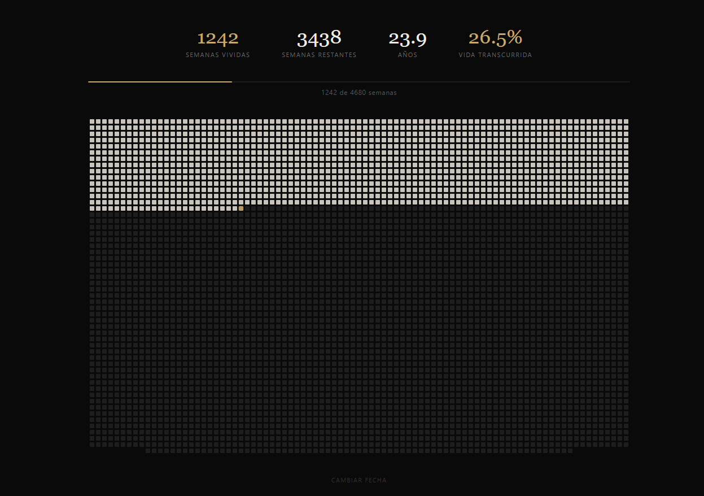
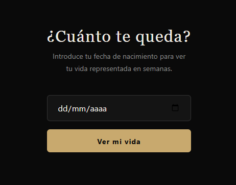

# Life Counter Widget

Una herramienta minimalista que representa tu vida en semanas, inspirada en el calendario de vida de Tim Urban. Introduce tu fecha de nacimiento y visualiza en tiempo real cuántas semanas has vivido y cuántas te quedan hasta los 90 años.

## Demo

🔗 [Ver en vivo](#) <!-- Añade la URL de Vercel aquí -->

## Cómo funciona

- Cada cuadrado representa una semana de vida (90 años × 52 semanas = 4.680 semanas)
- Los cuadrados claros son semanas vividas
- El cuadrado dorado es la semana actual
- Los cuadrados oscuros son semanas futuras
- Tu fecha se guarda en localStorage — no se vuelve a pedir

## Características

- Sin dependencias ni frameworks
- Un solo archivo HTML
- Funciona offline
- Responsive
- Soporta tecla Enter para confirmar la fecha

## Uso

Abre `index.html` directamente en el navegador o despliégalo en cualquier hosting estático.
